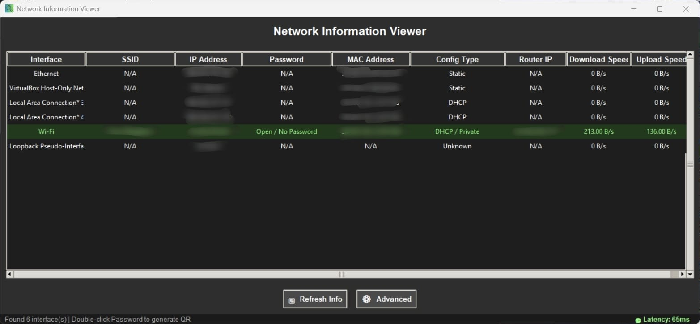
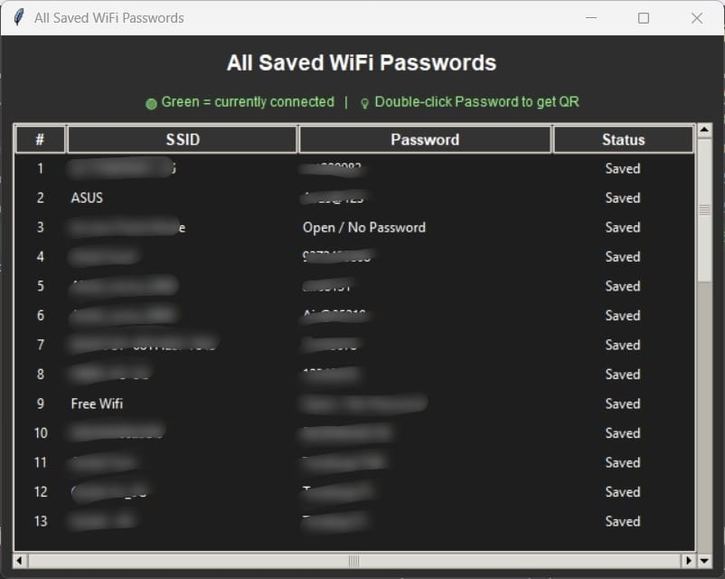
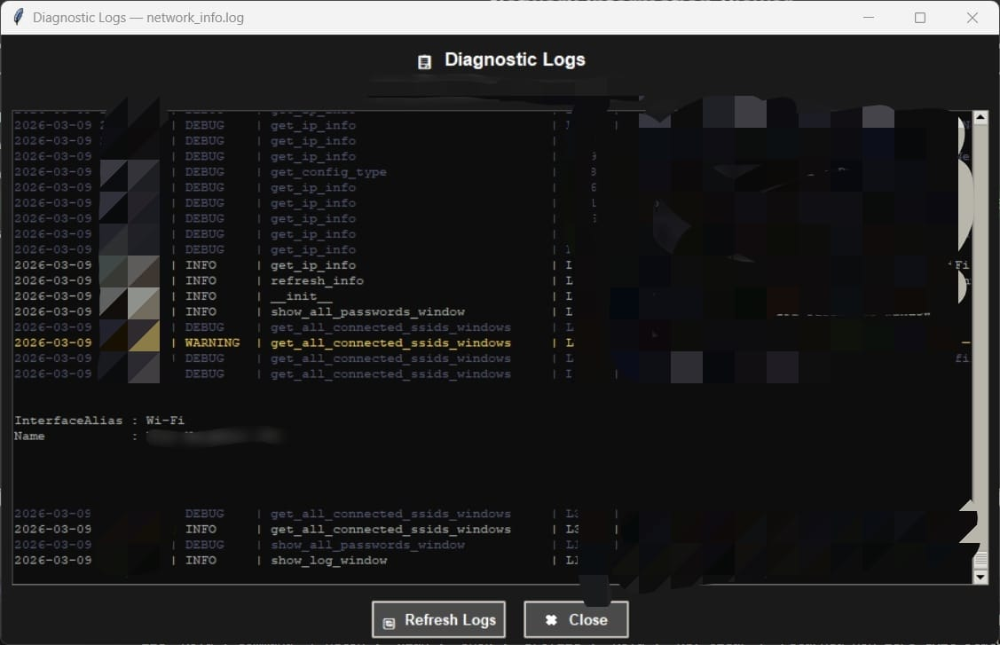

# 🌐 Network Info Viewer

> A lightweight, dark-themed Windows desktop application for viewing detailed network information, managing saved Wi-Fi profiles, and sharing Wi-Fi credentials via QR codes — all from a single intuitive interface.


---

## 📋 Table of Contents

- [Screenshots](#-screenshots)
- [Features](#-features)
- [Requirements](#-requirements)
- [Installation](#-installation)
- [Usage](#-usage)
- [Repository Structure](#-repository-structure)
- [Contributing](#-contributing)
- [License](#-license)

---

## 📸 Screenshots

> Screenshots are located in the [`Screenshots/`](./Screenshots) folder of this repository.

| Dashboard | Saved Passwords | Diagnostic Logs |
|:---------:|:---------------:|:---------------:|
|  |  |  |

---

## ✨ Features

- **Network Overview** — Instantly view your hostname, local IP address, MAC address, gateway, and DNS servers.
- **Saved Wi-Fi Passwords** — Retrieve passwords for all saved Wi-Fi profiles on your machine using Windows' built-in `netsh` commands.
- **QR Code Generator** — Double-click any saved Wi-Fi password to generate a scannable QR code for quick sharing on mobile devices.
- **Export to CSV** — Export your full list of saved Wi-Fi profiles (SSID + password + status) to a `.csv` file in one click.
- **Connection Status Indicators** — Visually highlights currently connected networks in green within the Wi-Fi table.
- **System Tray Support** — Minimise the app to the system tray and restore it at any time.
- **Diagnostic Log Viewer** — Built-in colour-coded log viewer that displays real-time application logs with severity levels (DEBUG, INFO, WARNING, ERROR).
- **Rotating Log File** — Application events are automatically logged to `network_info.log` (max 2 MB, 3 backups retained).
- **Auto-Dependency Installer** — Automatically installs missing Python packages (`qrcode`, `Pillow`) on first run — no manual pip commands needed.
- **Dark Theme UI** — Clean, modern dark interface built with Tkinter.

> ⚠️ **Windows Only** — This application is designed and tested exclusively for **Windows**. Features such as Wi-Fi password retrieval rely on Windows-specific commands (`netsh wlan`) and are not supported on macOS or Linux.

---

## 🛠 Requirements

### For the Executable (Recommended)
- Windows 10 or later
- No additional software required

### For Running from Source
- Windows 10 or later
- Python 3.8 or higher
- pip (Python package manager)

Install all required Python packages using:

```bash
pip install -r requirements.txt
```

**Core dependencies** (from `requirements.txt`):

| Package    | Purpose                                      |
|------------|----------------------------------------------|
| `psutil`   | Network interface and system info retrieval  |
| `qrcode`   | QR code generation for Wi-Fi sharing         |
| `Pillow`   | Image rendering for QR codes in the GUI      |
| `pystray`  | System tray icon support                     |

> **Note:** `tkinter` is included with the standard Python installation on Windows and does not need to be installed separately.

---

## 📦 Installation

### Option 1 — Run the Executable (No Python Required)

This is the recommended option for general users who do not have Python installed.

1. Navigate to the [`Exe/`](./Exe) folder in this repository.
2. Download and run `Network Info Viewer.exe`.
3. Windows may show a SmartScreen warning — click **"More info"** → **"Run anyway"** to proceed.
4. The application will launch immediately. No installation is required.

---

### Option 2 — Run from Source (Python)

This option is recommended for developers or users who want to run or modify the source code directly.

**Step 1 — Clone the repository**

```bash
git clone https://github.com/Vedant-Golait/Network-Info.git
cd Network-Info
```

**Step 2 — (Optional but recommended) Create a virtual environment**

```bash
python -m venv venv
venv\Scripts\activate
```

**Step 3 — Install dependencies**

```bash
pip install -r requirements.txt
```

**Step 4 — Run the application**

```bash
python Network_Info.py
```

> The app will automatically install any missing optional packages (`qrcode`, `Pillow`) on first launch.

---

## 🚀 Usage

Once the application is running:

| Action | How To |
|---|---|
| View network info | Launches automatically on startup; click **Refresh** to update |
| View saved Wi-Fi passwords | Click the **"All Wi-Fi Passwords"** button |
| Generate a Wi-Fi QR code | In the passwords window, **double-click** a password cell |
| Export Wi-Fi profiles to CSV | In the passwords window, click **"Export CSV"** |
| View diagnostic logs | Click the **"View Logs"** button |
| Minimise to system tray | Click the minimise button (if `pystray` is installed) |

---

## 📁 Repository Structure

```
Network-Info/
│
├── Screenshots/                 # Application screenshots
│   ├── Dashboard.jpeg
│   ├── Saved_pass.jpeg
│   └── log.jpeg
│
├── Exe/                         # Pre-built Windows executable
│   └── Network Info Viewer.exe
│
├── Network_Info.py                      # Main application source file
├── requirenments.txt            # Python dependencies
└── README.md                    # Project documentation
```

---

## 🤝 Contributing

Contributions are welcome! Whether you're fixing a bug, improving the UI, or suggesting a new feature — feel free to get involved.

1. **Fork** the repository
2. **Create** a new branch (`git checkout -b feature/your-feature-name`)
3. **Commit** your changes (`git commit -m "Add: your feature description"`)
4. **Push** to the branch (`git push origin feature/your-feature-name`)
5. **Open a Pull Request** and describe what you've changed

All contributions, big or small, are appreciated. 🙌

---

## 📄 License

This project is licensed under a **Custom MIT-Based License** — see the [`LICENSE`](./LICENSE) file for full details.

© 2025 Vedant Golait. Free to use, modify, and distribute **with the following conditions:**

- Any modified version or derivative work must **explicitly credit** "Network Info Viewer" by Vedant Golait as the base project.
- Any public release of a modified version must **notify the author** at 📧 [vedantgolait04@gmail.com](mailto:vedantgolait04@gmail.com) prior to or at the time of release.

---

<p align="center">
  Built with ❤️ for Windows users who want network clarity at a glance.

</p>
